# PranaVahini — Operator & Evaluator User Guide

PranaVahini provides role-differentiated interfaces designed for District Medical Officers (DMOs), Civil Surgeons, and rural Primary Health Centre (PHC) staff across Maharashtra's Western Ghats.

---

## 🧭 Navigation & View Overview

The navigation sidebar reflects the exact modules active in the application:

| Sidebar View | Target User | Key Capabilities |
| :--- | :--- | :--- |
| **Command Center** | District Medical Officer | Real-time network telemetry across 15 PHCs, critical stockout cards, active emergency alerts, executive metrics. |
| **Geospatial Map** | Emergency Logistics Officer | Interactive Leaflet GIS map with dual-channel color/shape markers, mountain transit corridors, and facility slide-over drawers. |
| **Facility Stocks** | District Pharmacist | Consolidated inventory grid across 182 active stock batches (183 total), FEFO expiry countdowns, and cold-chain temperature telemetry. |
| **AI Rebalancer** | Civil Surgeon / DMO | Autonomous peer-to-peer redistribution recommendations, mountain transit physics, medical SOAP explainability, and Human-in-the-Loop authorization. |
| **Transfers & Ledger** | Regulatory / Logistics Officer | End-to-end transfer tracking across the 5-stage state machine, 192-block DSCSA Cryptographic Ledger Explorer, and 1-click ledger integrity verification. |
| **Field Portal & OCR** | Rural PHC Nurse / ANM | Dual-mode frontline interface: Rapid touch dispensing logger with Marathi/Hindi speech dictation AND Multimodal Gemini 3.6 Flash Vision OCR for handwritten paper registers. |
| **Crisis Simulator** | Disaster Response Team | Realistic epidemiological shock injection (Monsoon floods, snakebite spikes), automated swarm dispatch, and baseline state recovery. |

---

## 🛠️ Step-by-Step Feature Walkthrough

### 1. Command Center Telemetry & Executive Metrics
- **Navigating:** Click **Command Center** in the sidebar.
- **Key Capabilities:**
  - Real-time network health gauge, aggregated unit quantities across all 15 facilities, active critical stockout alerts, and live emergency notifications.
  - Quick-action buttons to jump directly into the Geospatial Map, initiate peer-to-peer AI Rebalancing, or drill down into facility inventories.
  - Multi-lingual localization toggle (English, मराठी, हिन्दी) directly accessible in the top header.

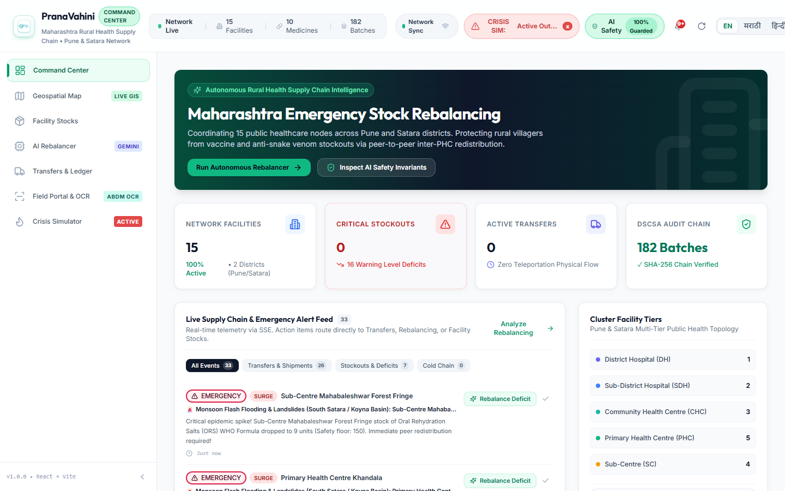

- **Multilingual Support (मराठी DHS Standard):**
  - Instant localization adopting official Maharashtra Directorate of Health Services (DHS) administrative terminology.

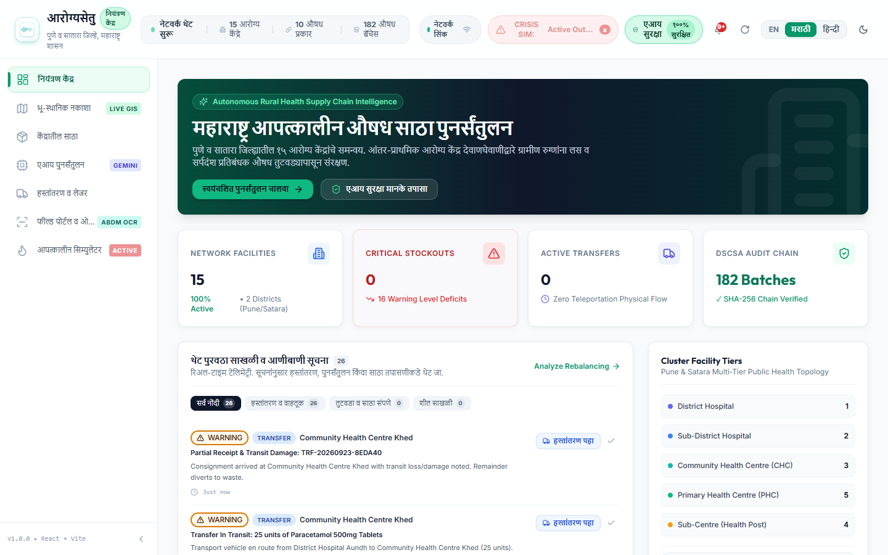

---

### 2. Geospatial GIS Command Map
- **Navigating:** Click **Geospatial Map** in the sidebar.
- **Interpreting Markers:**
  - 🟢 **Green Pin (Circle):** Normal operating inventory ($\ge 14$ days buffer).
  - 🟡 **Yellow Pin (Triangle):** Low inventory warning ($< 7$ days buffer).
  - 🔴 **Red Pin (Octagon 🚨):** Acute stockout risk ($< 48$ hours buffer).
- **Mountain Transit Corridors:**
  - Visualizes real-time transit corridors across Western Ghats mountain passes (e.g. Bhor Ghat, Varandha Ghat) with route elevations and transit hour estimates.

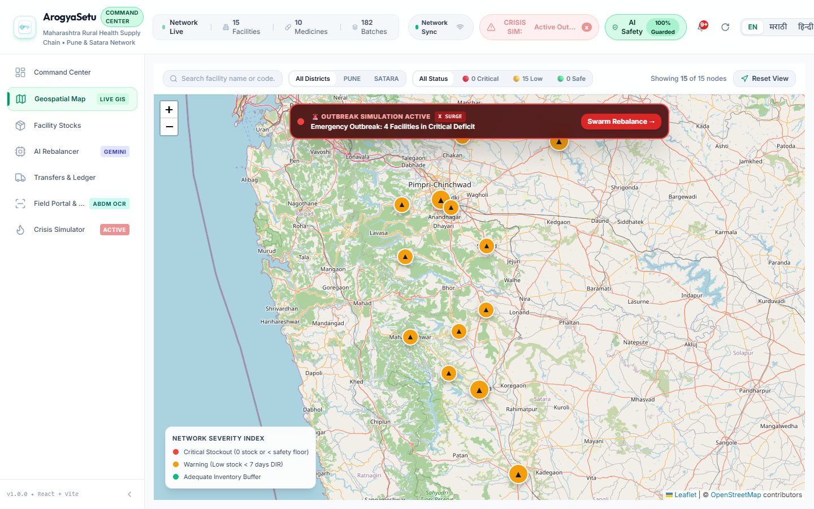

- **Inspecting a Facility:**
  - Click any facility marker (e.g. *PHC Bhor*, *CHC Khed*, or *PHC Wai*) to open the non-destructive facility slide-over drawer.
  - View active medicine batches, cold-chain status (`2°C - 8°C OK`), Daily Average Consumption (DAC), and depletion velocity without leaving the map context.

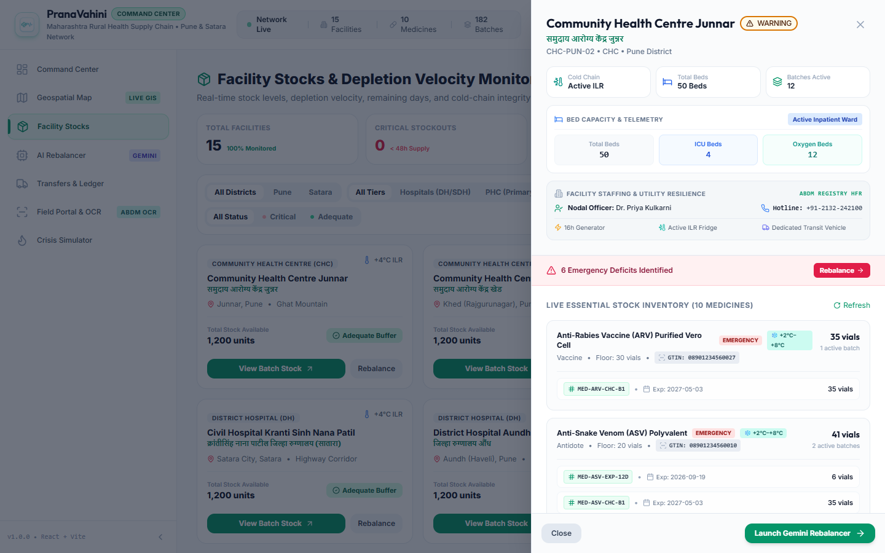

---

### 3. Consolidated Facility Stocks & FEFO Expiry Countdown
- **Navigating:** Click **Facility Stocks** in the sidebar.
- **Key Capabilities:**
  - Searchable and filterable table across all 182 active medicine batches (183 total) distributed throughout the district.
  - First-Expiry-First-Out (FEFO) color-coded badges highlighting imminent shelf-life expirations.
  - Temperature compliance indicators verifying vaccine and antivenom cold-chain integrity.

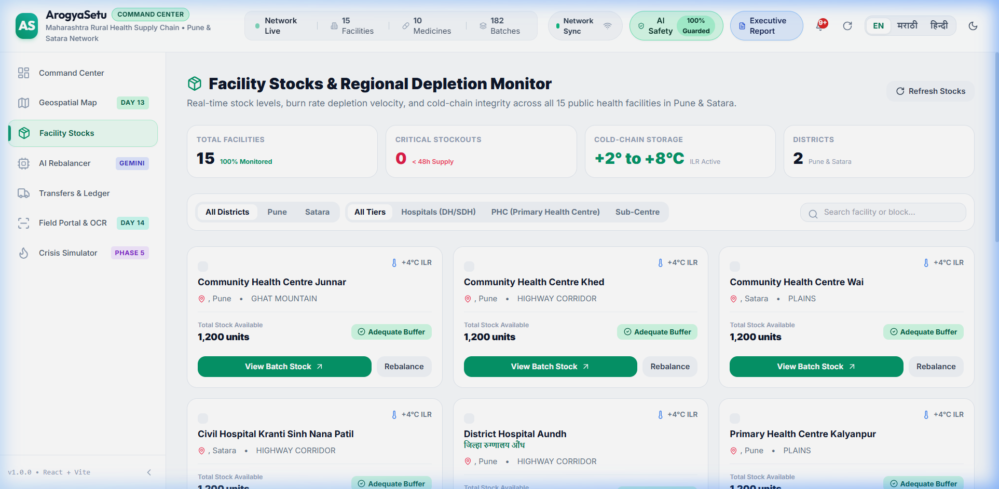

- **Localized Inventory Management (मराठी):**
  - Regionalized facility stock inventory grid with authentic Maharashtra DHS gazetteer phrasing (*आरोग्य केंद्रांमधील औषध साठा व साठा संपण्याचा वेग*, *सुरक्षित साठा*, *पुनर्संतुलन करा*), seamlessly linking to batch-level depletion velocity (*साठा संपण्याचा वेग*) and days of inventory remaining (*शिल्लक साठा (दिवस)*).

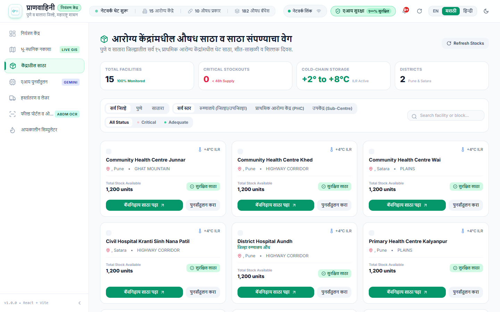

---

### 4. Autonomous AI Rebalancer (Gemini 3.6 Flash + Safety Firewall)
- **Navigating:** Click **AI Rebalancer** in the sidebar.
- **Evaluating Deficits & Donors:**
  - Select a facility experiencing a medicine deficit.
  - The engine scans donor candidates within a 50 km radius, accounting for steep Sahyadri mountain ghat transit hours, cold-chain Ice-Lined Refrigerator (ILR) readiness, and FEFO shelf life.
  - The deterministic `AISafetyGuard` firewall verifies that the donor retains $\ge 14$ days of reserve stock ($\ge 21$ days during monsoon) to prevent secondary starvation.

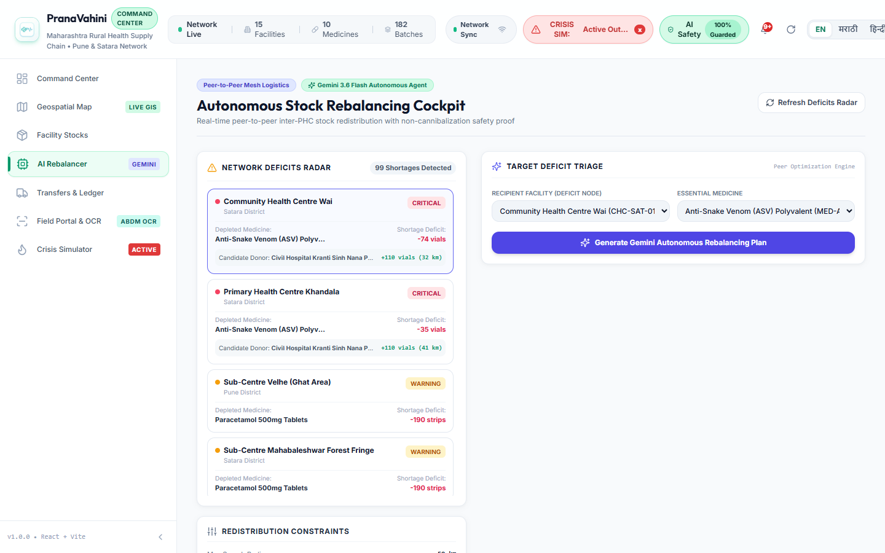

- **AI-Generated Redistribution Plan:**
  - View exact allocated batches, transit distance calculations, terrain risk ratings, and clinical SOAP reasoning notes.

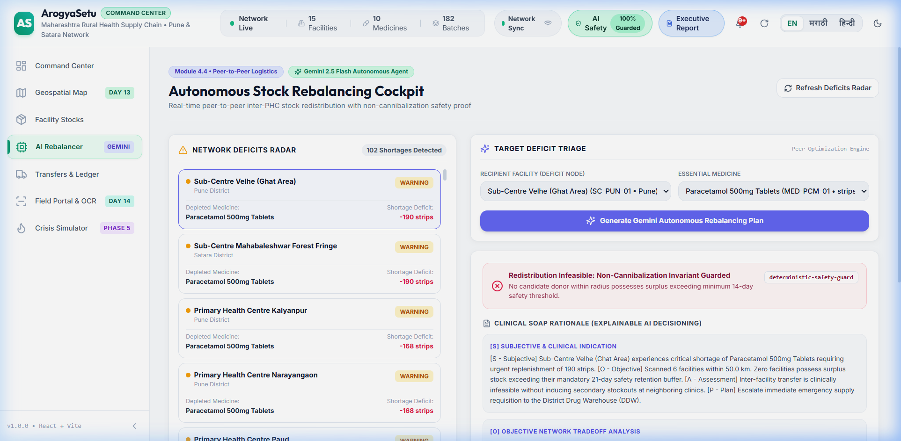

- **Authorizing a Transfer:**
  1. Click **Review & Authorize Transfer** on any recommended order.
  2. Inspect the medical SOAP note generated by Gemini 3.6 Flash explaining the clinical and logistical rationale.
  3. Verify cold-chain transport confirmation.
  4. Click **Authorize & Commit Inter-PHC Transfer**.
  5. The transfer moves into the active transfer table and appends a SHA-256 block into the immutable ledger.

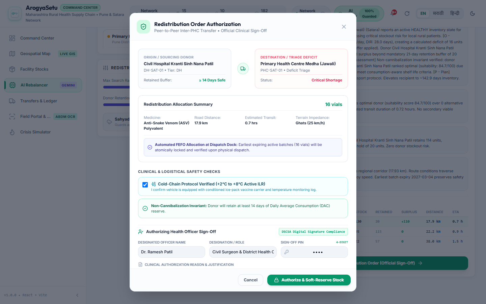

- **Safety Invariant Verification:**
  - Click the **Safety Verification** badge to inspect the 6 mathematically enforced invariants (No Zero-Stock Source, Preservation of Donor Safe Buffer, Mountain Transit Physics, FEFO Prioritization, Cold-Chain Preservation, and Single Active Transfer Lock).

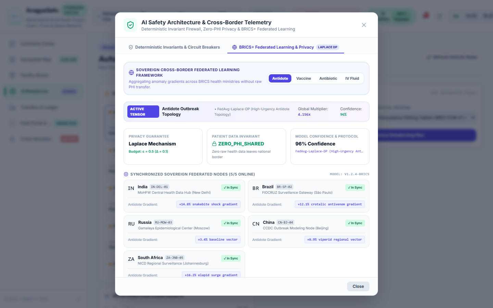

---

### 5. Inter-Facility Transfers & DSCSA Cryptographic Ledger
- **Navigating:** Click **Transfers & Ledger** in the sidebar.
- **Sub-Tab 1: Inter-Facility Transfers:**
  - Track medicine movements across the state machine: `DRAFT`, `APPROVED`, `DISPATCHED`, `IN_TRANSIT`, `RECEIVED`.
  - Filter by lifecycle status pills (`All Transfers`, `In-Transit / Dispatched`, `Approved`, `Completed`, `Draft`) or search by transfer number, facility, or medicine name.
  - View transit distance, estimated travel duration, dispatch vehicle, and cold-chain compliance.

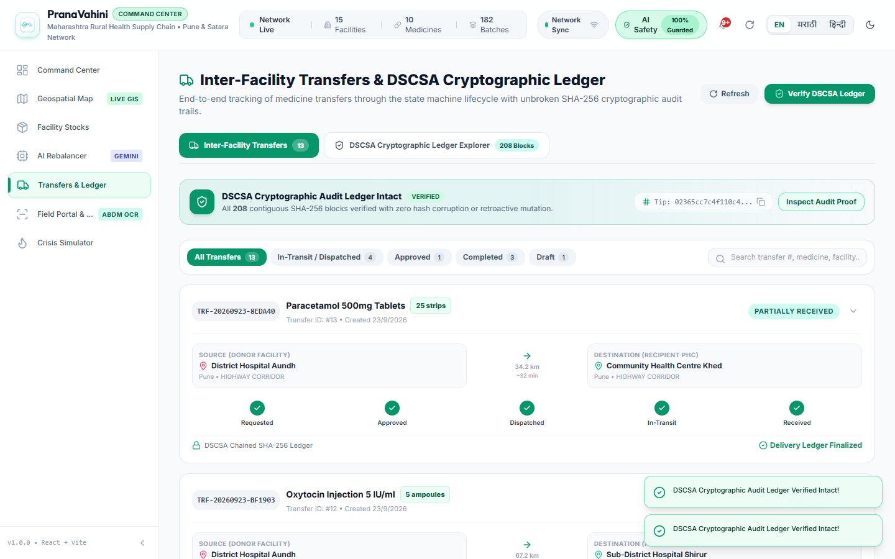

- **Regional Marathi Transfers Stepper:**
  - Administrative status verbs (*मागणी केली → मंजूर → पाठवले → मार्गावर → प्राप्त*) with distinct origin and destination facility badges.

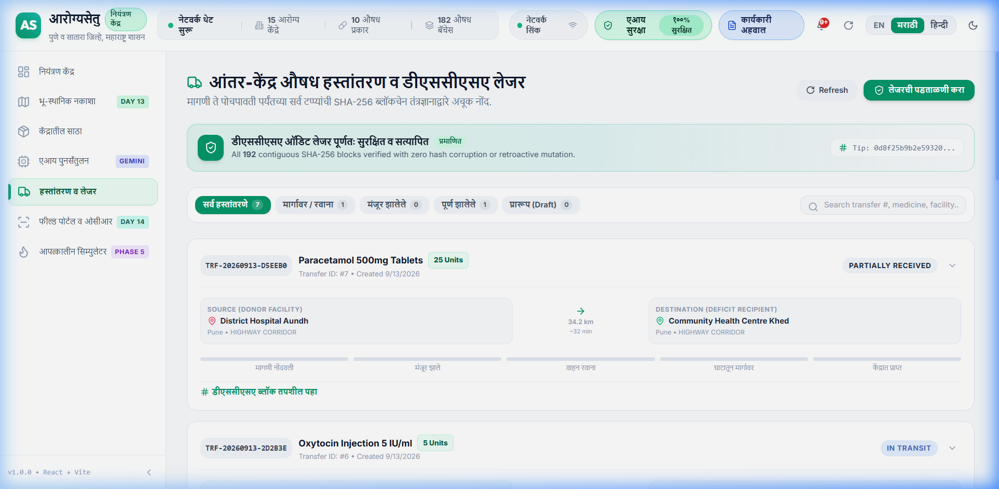

- **Cryptographic Custody Trail:**
  - Expand any transfer row to reveal its sequential chain of custody, driver identity, vehicle registration, and genesis transaction block.

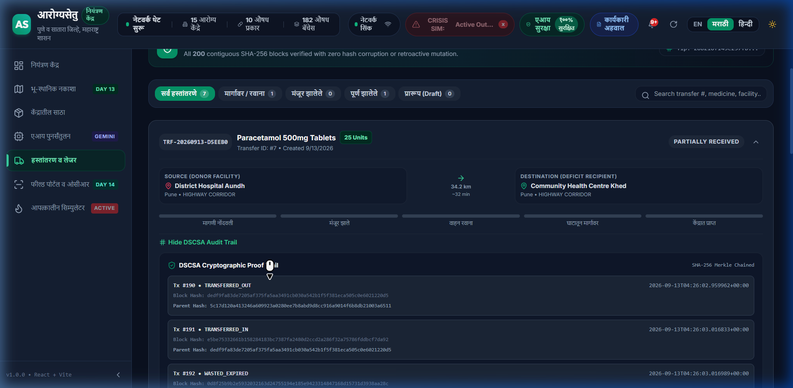

- **Sub-Tab 2: DSCSA Cryptographic Ledger Explorer:**
  - Switch to the **DSCSA Cryptographic Ledger Explorer** tab to inspect the blockchain-grade audit trail.
  - Browse all 192 SHA-256 transaction blocks with chronological timestamps, GS1 Global Location Numbers (GLN), Global Trade Item Numbers (GTIN), batch numbers, and quantity mutations.
  - Click any hash badge to copy the full 64-character SHA-256 hexadecimal hash.

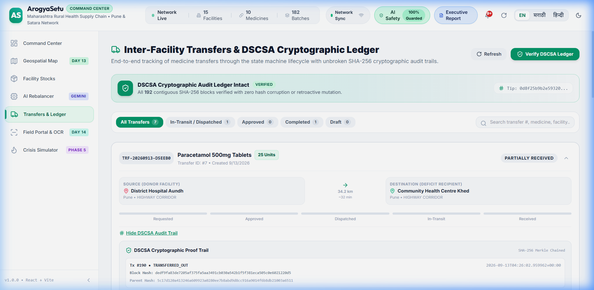

- **Verifying Ledger Integrity:**
  - Click the green **Verify DSCSA Ledger** button at top right.
  - The **DSCSA Cryptographic Audit Verification Modal** appears, computing every contiguous parent-child hash pointer in real time.
  - Displays `100% VALID`, `192 Verified Blocks`, `UNBROKEN Chain`, and the current tip block hash.

---

### 6. Field Portal: Quick Daily Consumption Logger
- **Navigating:** Click **Field Portal & OCR** in the sidebar. By default, the view opens on the **Quick Daily Consumption Logger** sub-tab.
- **Rapid Frontline Logging:**
  - Select an essential medicine and batch from the facility inventory.
  - Use enlarged PPE touch buttons (`-1`, `-5`, `-10`, `-20`) to log patient dispensations with immediate tactile vibration and audio confirmation.

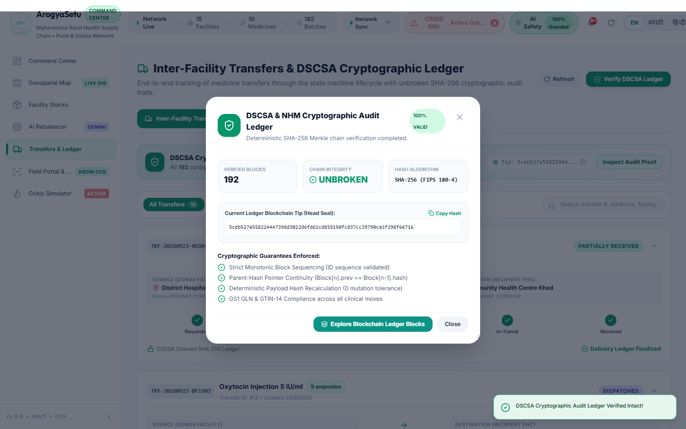

- **Multilingual Hands-Free Speech Dictation:**
  - Click the microphone icon (**मराठी • हिन्दी • English**).
  - Speak a clinical dispensation command (e.g. *"Dispensed 5 vials of Anti-Snake Venom"*).
  - The Web Speech API populates the medicine and quantity fields automatically.

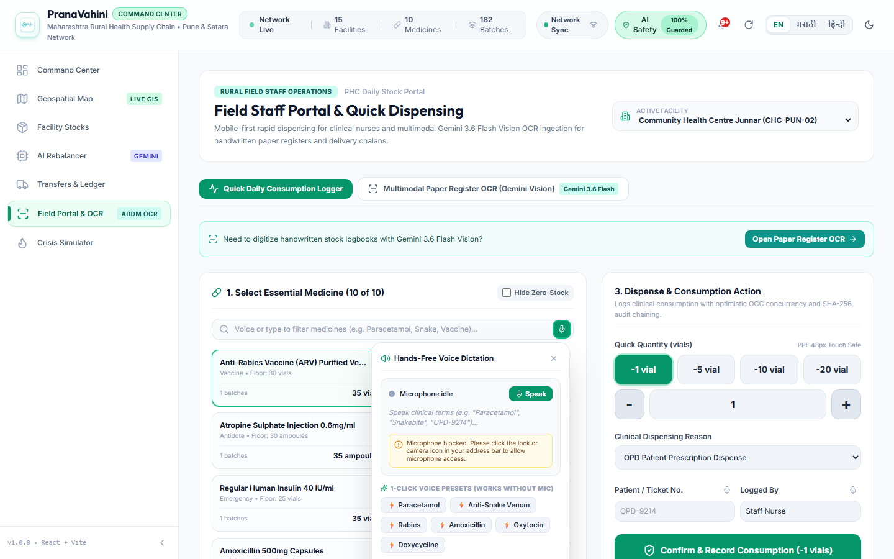

- **Offline Resilience & Sync:**
  - If rural 2G/3G connectivity drops, transactions are stored securely in the local browser IndexedDB queue and flushed with 1-click sync when connectivity resumes.

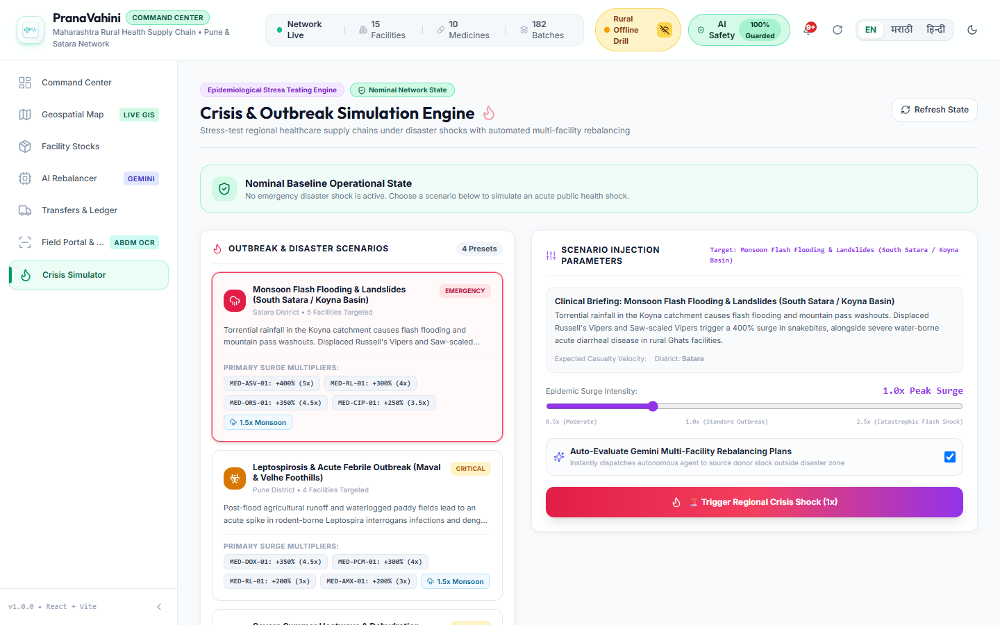

---

### 7. Multimodal Paper Register OCR (Gemini 3.6 Flash Vision)
- **Navigating:**
  - In **Field Portal & OCR**, click the sub-tab: **Multimodal Paper Register OCR (Gemini Vision)** (or click the callout banner *"Need to digitize handwritten stock logbooks with Gemini 3.6 Flash Vision? Open Paper Register OCR →"*).
- **Loading Sample Data or Uploading:**
  - Click **`⚡ Load Sample Register`** to immediately load an authentic photograph of a handwritten Maharashtra DHS stock register / delivery challan.
  - Or drag-and-drop / photograph a physical stock voucher.

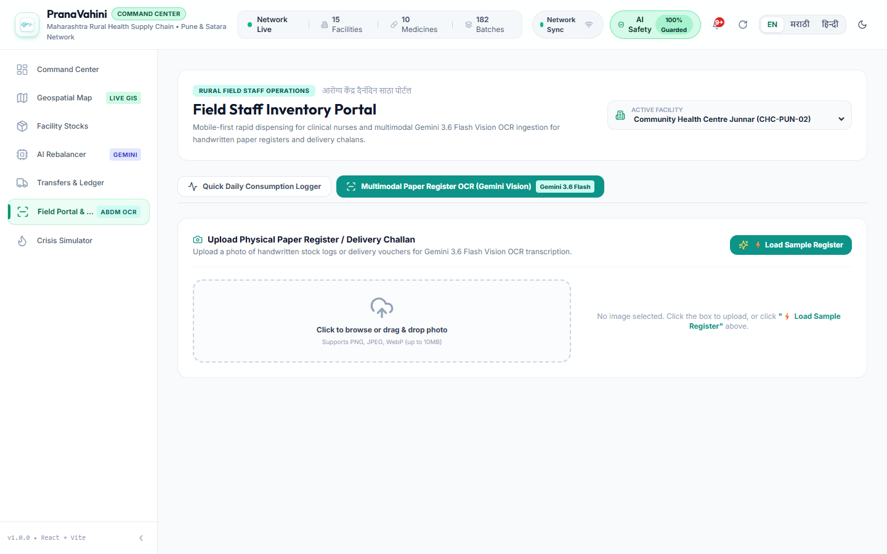

- **AI Transcription & Formulary Matching:**
  - Click **`Analyze Register with Gemini Vision`**.
  - Google Gemini 3.6 Flash Vision scans the handwritten logbook, extracting medicine names, batch numbers, expiry dates, and quantities into a structured digital verification table.
  - Fuzzy matching via `RapidFuzz` links transcribed names to the state drug formulary with confidence percentages.
- **Pharmacist Verification Gate:**
  - Any ambiguous entry highlights a yellow warning with mandatory pharmacist sign-off.
  - Click **Commit Scanned Items into Inventory** to atomically insert or update batches in SQLite and log SHA-256 ledger transactions.

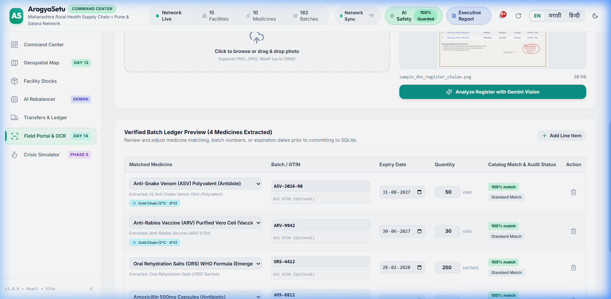

---

### 8. Crisis & Disaster Simulation
- **Navigating:** Click **Crisis Simulator** in the sidebar.
- **Baseline State:**
  - View pre-crisis facility metrics, stable inventory reserves, and baseline consumption trends.

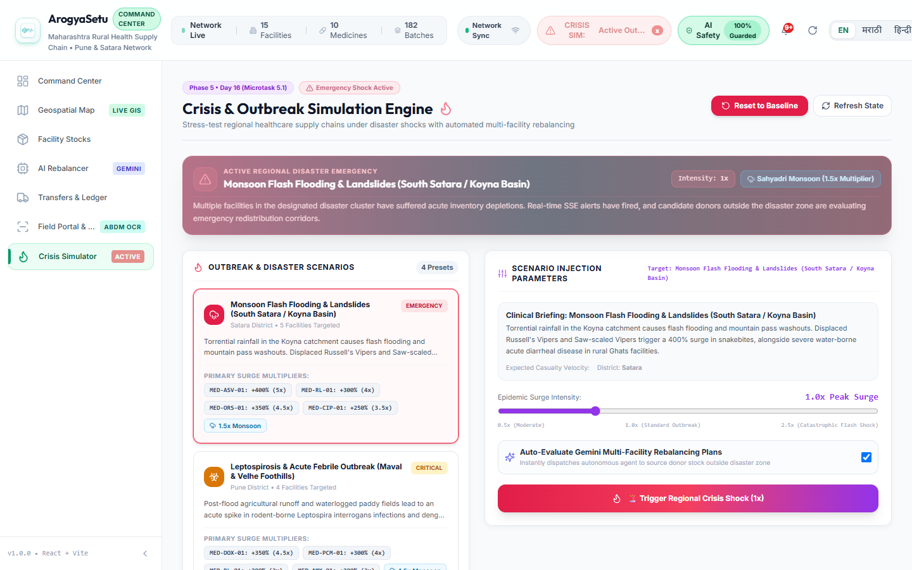

- **Injecting an Emergency Shock:**
  1. Select an epidemiological crisis preset (e.g. *Monsoon Flooding & Landslides — South Satara*).
  2. Click **Activate Emergency Simulation Shock**.
  3. Observe immediate network-wide changes: casualty surges, acute stockout warnings, automated Swarm Dispatch pairing, and red emergency alerts across the command center.

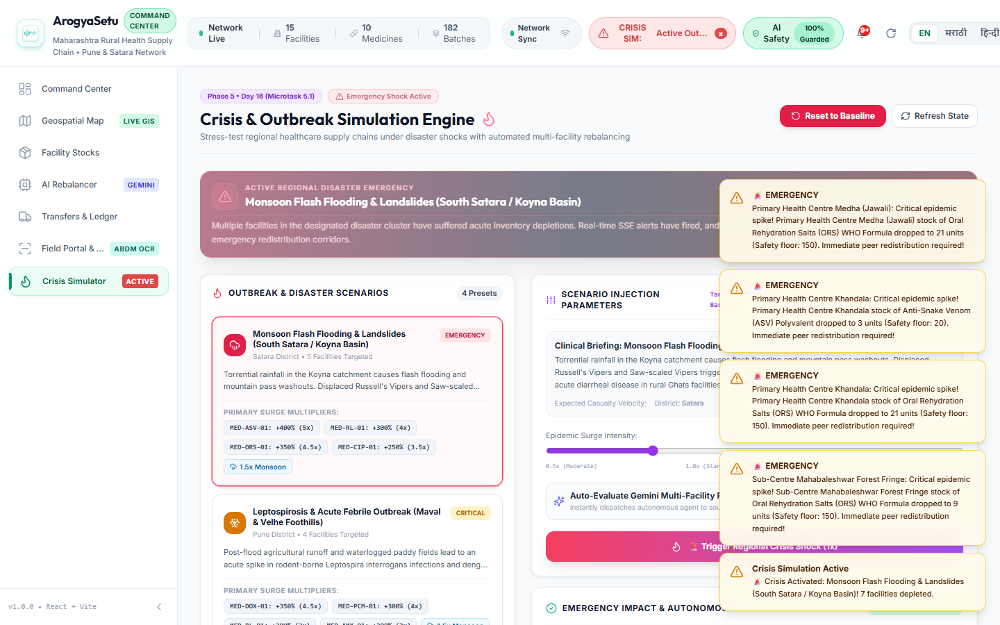

- **Restoring Baseline:**
  - Click **Reset Simulation to Baseline** to restore initial pre-crisis inventory with automatic reconciliation.
