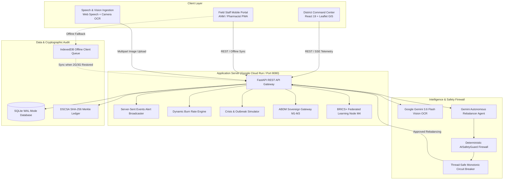

# ArogyaSetu — System Architecture & Technical Design

ArogyaSetu is a federated public health emergency logistics and inter-facility stock rebalancing platform designed for rural India. It transforms isolated Primary Health Centres (PHCs) into an interconnected, real-time supply network capable of preventing stockouts of critical life-saving medicines (such as Anti-Snake Venom, Rabies Vaccines, Insulin, and Emergency Antibiotics) across complex mountain terrain.

---

## 1. High-Level C4 Container Architecture

---

## 2. Core Functional Subsystems

### A. Zero-Friction Multimodal Data Ingestion Layer
- **Problem:** Rural PHC pharmacists maintain physical paper registers (*दैनिक औषध नोंदवही*) and cannot spend time typing into complex ERP systems.
- **Architecture:** Field staff photograph physical paper registers or drug boxes. The image is processed through Google Gemini 3.6 Flash Vision using strict Pydantic JSON schemas with `RapidFuzz` clinical catalog disambiguation.
- **Pharmacist-in-the-Loop:** Any low-confidence handwriting triggers an explicit clinical cross-verification review gate before committing to the database.

### B. Dynamic Burn Rate & Acute Outbreak Surge Detection
- **Calculations:** Computes Daily Average Consumption (DAC) across sliding windows (7-day, 14-day, 30-day) and Days of Inventory Remaining (DIR).
- **Surge Multipliers:** When an acute outbreak occurs (e.g. monsoon flooding or snakebite clusters), consumption velocity $V_{\text{surge}}$ triggers emergency Server-Sent Events (SSE) broadcasts to the district command map within milliseconds.

### C. Gemini Autonomous Rebalancer & AISafetyGuard Firewall
- **Decision Engine:** Scans candidate donor PHCs within a 50 km radius, taking into account:
  1. Mountain road travel physics across Western Ghats (Sahyadri passes).
  2. Ice-Lined Refrigerator (ILR) cold-chain compatibility (2°C to 8°C).
  3. First-Expiry-First-Out (FEFO) shelf-life buffers.
- **Deterministic Guardrails:** The `AISafetyGuard` enforces non-negotiable physical constraints:
  - **Rule 1 (Non-Cannibalization):** Donor facilities must never drop below 14 days of safety stock (or 21 days during monsoon season).
  - **Rule 2 (Anti-Ghosting):** Rejection of any medication units not verified in SQLite.
  - **Rule 3 (Rural Blackout Demand Floor):** Guarantees baseline reserves even if communication lines drop.
- **Thread-Safe Circuit Breaker:** In the event of cloud connectivity loss, the circuit breaker opens and switches to an offline mathematical linear programming solver in $< 5\text{ ms}$.

### D. DSCSA & NHM Cryptographic Audit Trail
- Every stock mutation (receipt, consumption, quarantine, or inter-PHC transfer) appends an immutable block into `inventory_transactions`.
- Each block is sealed with:
  $$\text{Hash}_n = \text{SHA256}(\text{Hash}_{n-1} \parallel \text{GLN} \parallel \text{GTIN} \parallel \text{Batch} \parallel \text{Qty} \parallel \text{Timestamp})$$
- Ensures complete regulatory traceability against black-market pilferage.

### E. Rural Connectivity & Non-Punitive OCC 409 Resilience
- Built for intermittent 2G/3G connectivity in hill villages.
- Field workers can log medicine dispensation completely offline in IndexedDB.
- When cell reception resumes, transactions sync to the central server using Optimistic Concurrency Control (OCC). If a concurrent transfer occurred, an empathetic non-punitive reconciliation card explains the situation without technical crashes.

---

## 3. Technology Stack

| Layer | Component | Description |
| :--- | :--- | :--- |
| **Frontend** | React 19 + Vite | Mobile-first responsive UI, Lucide icons, Tailwind CSS |
| **Geospatial GIS** | Leaflet + React-Leaflet | Canvas-rendered interactive map with live status markers |
| **Backend API** | Python 3.11 + FastAPI | High-concurrency async REST gateway + SSE pub/sub |
| **Database** | SQLite (WAL Mode) | ACID relational persistence with Optimistic Concurrency Control |
| **AI / Multimodal** | Google Gemini 3.6 Flash | Multimodal vision OCR & autonomous rebalancing reasoning |
| **Containerization** | Docker Multi-Stage | Cloud Run production container (`node:20` + `python:3.11-slim`) |
