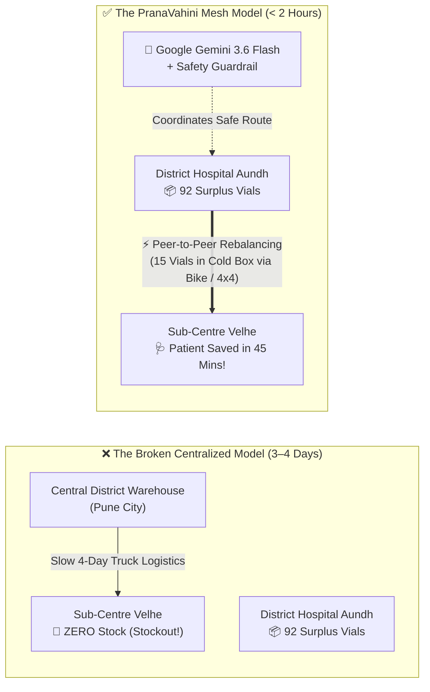
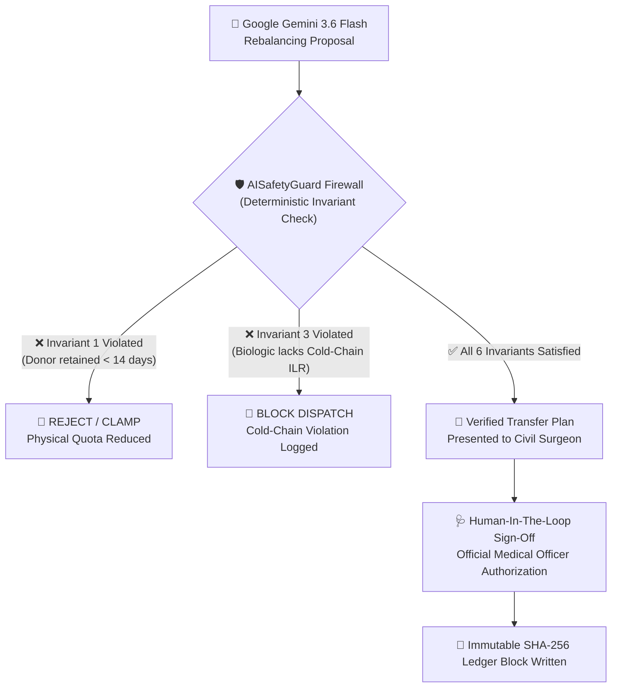
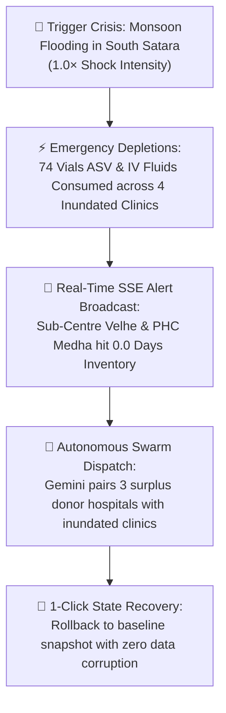

# 🩺 PranaVahini (प्राणवाहिनी) — Intuitive System Guide
> **The "Explain-It-Like-I'm-In-10th-Grade" Architectural & Operational Walkthrough**  
> *Track 03: Smart Health & Supply Chain Resilience (Theme: Resilience)*  
> *Google Cloud & Hack2Skill "Build with AI: Code for Communities"*  

[](https://pranavahini-615569835878.asia-south2.run.app)
[](https://pranavahini-615569835878.asia-south2.run.app/docs)
[](https://ai.google.dev/)
[](https://github.com/GitPhantom700/pranavahini)
[](https://pranavahini-615569835878.asia-south2.run.app)

---

## 📖 Chapter 1: The Ground Reality (A Tale of Two Clinics)

Imagine you live in **Velhe**, a small village nestled deep within the rugged Western Ghats (Sahyadri mountains) of Maharashtra. It is the peak of the monsoon season. Heavy rains have drenched the hillsides, and riverbeds are overflowing.

```
       🚨 CRISIS AT SUB-CENTRE VELHE                   ✨ SURPLUS AT DISTRICT HOSPITAL AUNDH
 ┌────────────────────────────────────────┐       ┌────────────────────────────────────────┐
 │ • A farmer is bitten by a Russell's    │       │ • Regional secondary hospital in Pune  │
 │   Viper in the paddy fields            │       │ • Has 92 surplus vials of ASV in ILR   │
 │ • Arrives at clinic within 20 mins     │       │ • Verified cold-chain refrigeration    │
 │ • CLINIC INVENTORY: ZERO VIALS!        │       │ • Sufficient stock to safely share     │
 └───────────────────┬────────────────────┘       └───────────────────┬────────────────────┘
                     │                                                │
                     ▼                                                ▼
     Central State Warehouse in Pune                 🚨 THE GOLDEN HOUR PROBLEM:
     Takes 3 to 4 days over flooded roads            The snakebite victim has < 2 hours!
```

### The Acute Dilemma
1. **The Life-or-Death Clock:** When someone is bitten by a venomous snake or exposed to rabies, doctors speak of the **"Golden Hour"** ($\le 2\text{ hours}$). Delaying Anti-Snake Venom (ASV) causes irreversible paralysis or internal hemorrhaging.
2. **The Traditional Warehouse Failure:** When a rural clinic runs out of stock, standard government procedure is to order from the central district warehouse in Pune. But delivery trucks take **3 to 4 days** to navigate treacherous ghat passes and seasonal landslides.
3. **The Heartbreaking Paradox:** At neighboring **District Hospital Aundh**, surplus vials sit chilling in an ice-lined refrigerator. But because these clinics operate on paper records and disconnected silos, **one clinic faces preventable death while another sits on idle surplus**.

---

## 💡 Chapter 2: What is PranaVahini?

**PranaVahini (प्राणवाहिनी)** — Sanskrit for *"The Vital Conduit of Life"* — is an autonomous, peer-to-peer emergency healthcare logistics network. 

Instead of waiting days for a distant warehouse truck, PranaVahini connects all 15 rural clinics across Pune and Satara into an **intelligent cooperative mesh**.



> [!TIP]
> **The Bottom Line:** PranaVahini transforms isolated rural clinics into an interconnected self-healing network. When an emergency strikes, it moves life-saving medicine **in hours instead of days**.

---

## 🤖 Chapter 3: Why Do We Need AI for This?

A common question is: *"Why can't a simple spreadsheet or rule-based calculator do this?"*

In a classroom textbook, a simple subtraction formula works. But in the unpredictable terrain of rural India, healthcare logistics must respect complex physical and biological constraints:

| Real-World Challenge | Why Basic Software Fails | How PranaVahini's Google AI Solves It |
| :--- | :--- | :--- |
| **⛰️ Mountain Roads vs. Highways** | $20\text{ km}$ on a flat national highway takes 20 minutes. But $20\text{ km}$ over the Varandha Ghat pass during a monsoon storm takes **2.5 hours** with severe landslide risks. | **Terrain-Aware Physics:** Ingests elevation, road grade, and seasonal monsoon multipliers ($1.5\times$ travel time penalty) to calculate realistic transit survival windows. |
| **❄️ Sensitive Cold-Chain Biologics** | Vaccines and Anti-Snake Venom spoil and turn toxic if their temperature climbs above $8^\circ\text{C}$ for prolonged periods. | **ILR Validation:** Verifies that both the donor facility and dispatch transport have certified Ice-Lined Refrigerators (`has_cold_chain = 1`) before approving biologics movement. |
| **⏳ First-Expiry-First-Out (FEFO)** | Moving older stock that expires tomorrow causes medication to spoil in transit or shortly after arrival. | **FEFO Expiry Auditing:** Mathematical lot assignment guarantees batches have at least $\text{Transit Hours} + 7\text{ days}$ of usable shelf life remaining. |
| **🩺 Doctor-Friendly Clinical Rationale** | Doctors and Civil Surgeons do not trust "black-box" algorithmic numbers. | **Automated Clinical SOAP Notes:** Gemini 3.6 Flash writes a formal clinical memorandum (*Subjective, Objective, Assessment, Plan*) explaining *why* the donor was selected and *how* community safety is maintained. |

---

## 🛡️ Chapter 4: The "AI Safety Referee" (Zero-Hallucination Firewall)

Large Language Models (LLMs) like Google Gemini are brilliant, but they can occasionally make mistakes or hallucinate. In healthcare, an AI mistake can be fatal.

### The Exam Room Analogy:
> Imagine a smart robot helping students share stationery during a final exam:
> * **Student A** has **0 pencils** (Emergency!).
> * **Student B** has only **2 pencils** (They need 1 to write their exam and 1 backup).
> 
> If the robot says: *"Take both pencils from Student B and give them to Student A!"*
> Now Student B has **0 pencils** and fails their exam!
> 
> **In a hospital:** If an AI takes all 25 vials of antivenom from Clinic B to save Clinic A, Clinic B is left completely defenseless. If a farmer is bitten near Clinic B tomorrow morning, **they die because the AI cannibalized their stock!**

To guarantee absolute safety, PranaVahini places a hardcoded, deterministic Python firewall called **`AISafetyGuard`** between the AI and the database:



### The 6 Physical Invariants Enforced by `AISafetyGuard`
1. **Rule 1 — Non-Cannibalization / Zero Starvation:** A donor clinic must **always** retain at least **14 days of average consumption** (extended to **21 days during monsoon season**). The AI is physically blocked from touching this emergency safety cushion.
2. **Rule 2 — Physical Stock Bounding:** The AI cannot allocate "ghost inventory." Every transferred vial is mapped to a verified, unexpired batch number physically present in the database.
3. **Rule 3 — Cold-Chain Verification:** Heat-sensitive medications (ARV, ASV, Insulin) can only be dispatched from facilities with active, working Ice-Lined Refrigerators.
4. **Rule 4 — Transit & FEFO Feasibility:** A batch cannot be moved if its expiration date falls within the transit time plus a 7-day clinical buffer.
5. **Rule 5 — Rural Blackout Demand Floor:** If a remote clinic loses power and internet for 5 days during a cyclone, its recorded consumption drops to zero. The system recognizes this anomaly and enforces an automatic default consumption floor ($1.0\text{ unit/day}$) so its safety stock is never cannibalized.
6. **Rule 6 — Payload Distrust & Prompt Injection Defense:** All incoming inputs pass through strict regex filters to strip adversarial manipulation attempts before reaching the AI.

---

## ⚡ Chapter 5: What is the "Circuit Breaker"?

### The Power Backup Analogy:
> In your home, if lightning strikes the power lines or an electrical surge occurs, the circuit breaker (MCB) trips instantly to prevent your appliances from catching fire.
> 
> In a remote mountain clinic, what happens if a thunderstorm knocks out the cellular tower, or Google's cloud API becomes unreachable?
> 
> **Does the hospital screen freeze with an `"Error 500: Server Down"` while a snakebite victim is in agony?**
> 
> **ABSOLUTELY NOT.**

PranaVahini features an automated **`CircuitBreaker`**:
* **Autonomous Trip:** If 3 consecutive calls to the cloud AI fail or timeout, the Circuit Breaker trips from `CLOSED` to `OPEN`.
* **Sub-5-Millisecond Offline Failover:** The backend instantly switches to an internal **Deterministic Multi-Objective Optimization Engine** running locally on the server in **$< 5\text{ ms}$** ($0.005\text{ seconds}$).
* **Zero Disruption:** Doctors and nurses can continue rebalancing medicines without any internet connection.
* **Self-Healing Watchdog:** When connectivity is restored, a background watchdog tests the connection and flips the breaker back to normal operation.

---

## 📸 Chapter 6: Multimodal Vision OCR & Hands-Free Voice

Rural health centres rarely have time for manual keyboard data entry. PranaVahini bridges the analog-to-digital divide using Google AI:

### 1. Gemini 3.6 Flash Multimodal Vision OCR
Rural clinics record medicine receipts in paper logbooks (*दैनिक औषध नोंदवही*) and paper delivery challans.
* **How it works:** The pharmacist simply takes a photo of the handwritten ledger with a mobile phone.
* **The AI Action:** Google Gemini 3.6 Flash Vision reads the handwritten columns (Batch Number, Expiry Date, Quantity, Manufacturer).
* **Fuzzy Catalog Matching:** Integrates `RapidFuzz` to match messy handwriting against the official Indian National Essential Diagnostics & Medicines List.
* **Pharmacist Sign-Off:** The extracted table is displayed with high-confidence indicators (95%–98%) for quick 1-tap confirmation before committing to the database.

### 2. Hands-Free Voice Dictation for Gloved Staff
Rural Auxiliary Nurse Midwives (ANMs) wear latex PPE gloves while administering vaccines and emergency care. Typing on a keyboard with contaminated or wet gloves is a safety hazard.
* **Continuous Web Speech Recognition:** Allows nurses to speak dispensing actions naturally in **Marathi (`mr-IN`)**, **Hindi (`hi-IN`)**, or **English (`en-IN`)**.
* **One-Tap Clinical Chips:** Pre-programmed buttons (*⚡ Anti-Snake Venom*, *⚡ Rabies Vaccine*, *⚡ Paracetamol*) for rapid 1-second dispensing during mass-casualty emergencies.

---

## 🔐 Chapter 7: The Cryptographic Audit Ledger (DSCSA Standard)

In public health logistics, a major risk is **pilferage** — unauthorized diversion of expensive government medicine into private black markets.

PranaVahini implements an immutable **Cryptographic Audit Ledger** inspired by the U.S. Drug Supply Chain Security Act (DSCSA):
* **Tamper-Evident SHA-256 Chains:** Every action (`DISPENSE`, `RECEIVE`, `TRANSFER_APPROVE`, `DISPATCH`) creates a cryptographically signed data block containing the timestamp, facility GLN, batch GTIN, quantity, and the hash of the preceding block.
* **Unbroken Verification:** If anyone attempts to alter a record in the database directly, the cryptographic hash sequence breaks instantly, triggering an alert for the State Drug Inspector.
* **Current Audit State:** The system maintains an unbroken chain of **192 verified cryptographic blocks** from inception.

---

## 🌊 Chapter 8: The Epidemiological Crisis Simulator

Public health coordinators cannot wait for a real disaster to find out if their logistics will hold up. 

PranaVahini includes an interactive **Crisis Simulation Engine** that allows disaster response teams to run live stress tests:



---

## 🇮🇳 Chapter 9: Sovereign Indian Stack & Global BRICS Reach

PranaVahini is engineered to plug directly into India's national health architecture while remaining globally extensible:

```
┌────────────────────────────────────────────────────────────────────────┐
│             National Digital Health Stack (ABDM Integration)           │
├────────────────────────┬───────────────────────┬───────────────────────┤
│  🏥 HFR Verification   │  👨‍⚕️ HPR Registration │  🪪 ABHA Validation   │
│  Validates facilities  │  Verifies doctors and │  Links patient records│
│  via National Registry │  authorizing officers │  to national health IDs│
└────────────────────────┴───────────────────────┴───────────────────────┘
                                   │
                                   ▼
┌────────────────────────────────────────────────────────────────────────┐
│           BRICS+ Federated Learning Mesh (Hackathon Rule 04)           │
├────────────────────────────────────────────────────────────────────────┤
│  Federated anomaly detection across national health nodes:             │
│  🇮🇳 India (Delhi) • 🇧🇷 Brazil (São Paulo) • 🇷🇺 Russia (Moscow)         │
│  🇨🇳 China (Beijing) • 🇿🇦 South Africa (Johannesburg)                   │
│                                                                        │
│  Enables cross-border pandemic outbreak modeling without centralizing  │
│  sensitive citizen medical records outside sovereign borders.         │
└────────────────────────────────────────────────────────────────────────┘
```

---

## 📋 Chapter 10: Terminology & Acronym Cheat Sheet

| Term | Full Form | What It Means in Plain English |
| :--- | :--- | :--- |
| **PHC** | Primary Health Centre | A rural government clinic serving 20,000 to 30,000 villagers. |
| **CHC** | Community Health Centre | A 30-bed secondary hospital serving as a referral hub for 4 PHCs. |
| **DH** | District Hospital | The central multi-specialty government hospital in the district headquarters. |
| **ASV** | Anti-Snake Venom | Life-saving freeze-dried or liquid serum neutralizing venomous snakebites. |
| **ARV** | Anti-Rabies Vaccine | Post-exposure prophylaxis vaccine preventing fatal rabies virus infection. |
| **DIR** | Days of Inventory Remaining | How many days until a clinic completely runs out of medicine at its current rate. |
| **DAC** | Daily Average Consumption | The average number of units a clinic uses per day. |
| **FEFO** | First Expire, First Out | Always using and dispatching medicines that expire soonest to minimize waste. |
| **ILR** | Ice-Lined Refrigerator | Specialized solar or electrical medical fridges that maintain $2^\circ\text{C}$ to $8^\circ\text{C}$. |
| **SOAP** | Subjective, Objective, Assessment, Plan | The standard format doctors use to write structured medical notes. |
| **OCC** | Optimistic Concurrency Control | Database protection preventing two doctors from allocating the same batch at the same time. |
| **DSCSA** | Drug Supply Chain Security Act | Global traceability standard for securing pharmaceutical supply chains against counterfeits. |
| **ABDM** | Ayushman Bharat Digital Mission | India's national sovereign digital health infrastructure (HFR, HPR, ABHA). |
| **SSE** | Server-Sent Events | Web technology allowing the server to push real-time alerts to the browser instantly. |

---

## 🎯 Summary: What Happens When You Use PranaVahini

1. **You notice a red alert:** Sub-Centre Velhe has **0 vials of Anti-Snake Venom** remaining ($\text{DIR} = 0.0\text{ days}$).
2. **You trigger AI Rebalancing:** Google Gemini 3.6 Flash scans 15 facilities, evaluates mountain passes, cold storage, and batch expiration dates, identifying District Hospital Aundh as the optimal donor.
3. **The Safety Referee validates:** `AISafetyGuard` confirms District Hospital Aundh holds 92 surplus vials with verified cold-chain ILR and will retain 77 vials (38.5 days of reserve, safely above the 14d safety threshold).
4. **The Doctor signs off:** The Civil Surgeon inspects the generated clinical SOAP note and clicks **`Authorize & Commit Inter-PHC Transfer`**.
5. **The medicine is locked & moved:** An immutable SHA-256 block is stamped into the cryptographic ledger, an emergency dispatch driver is assigned, and a life is saved within the hour!

---

*Authored for **Build with AI: Code for Communities (Second Edition)** — Hack2Skill & Google Cloud.*